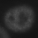
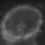
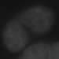
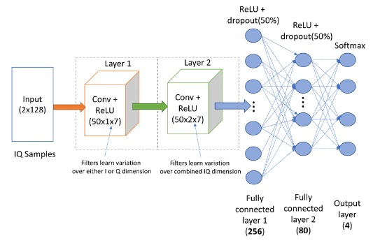

# Cell Classification with Convolutional Neural Networks (CNN)

## Dataset
The dataset contains 60,000 microscopic images of cells. It is split into training and testing sets for model training and evaluation, respectively.

## CNN Architecture
The CNN architecture used for cell classification consists of the following layers:
- Two convolutional layers with ReLU activation.
- Pooling layers for downsampling.
- Fully connected layers for classification.

(representative not exact)

## Evaluation
The model's performance is evaluated based on the F1 score, which is a harmonic mean of precision and recall. The F1 score provides a balanced measure of the model's accuracy, particularly useful for imbalanced datasets.

